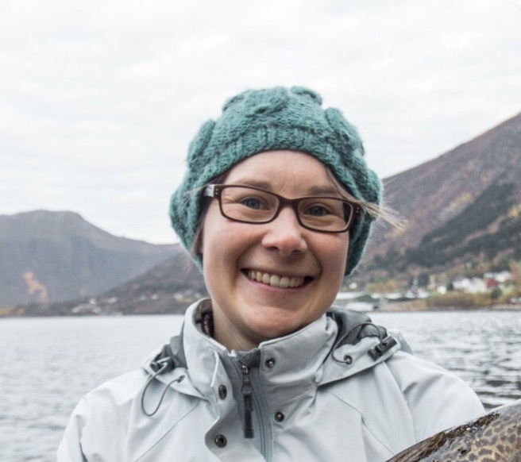
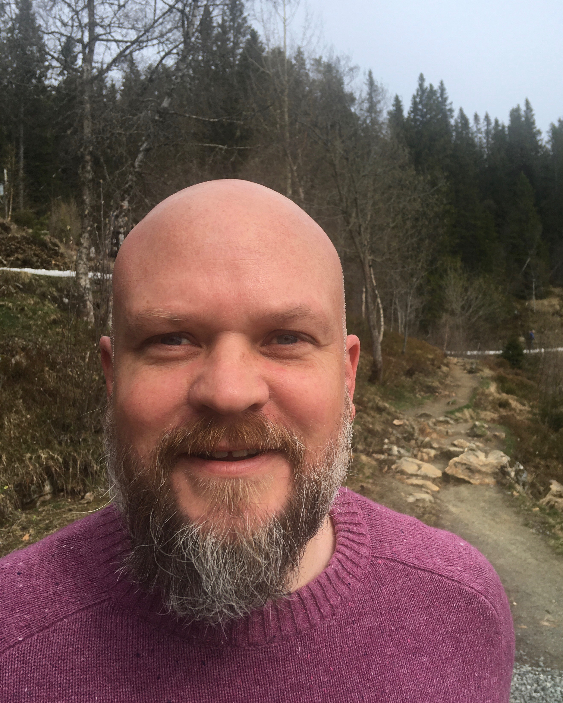
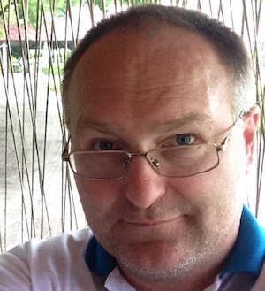
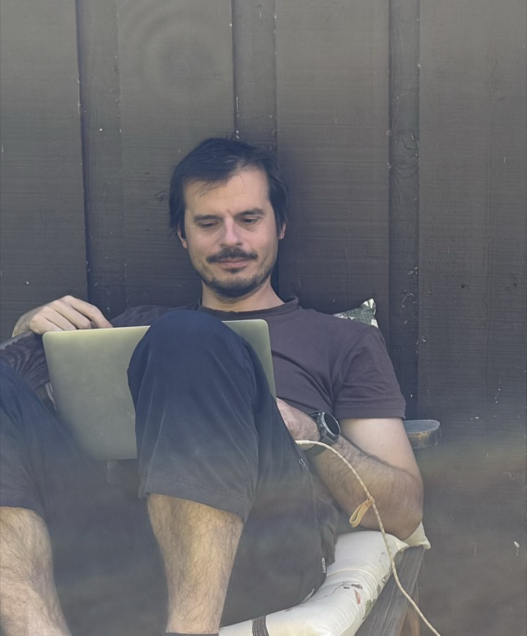
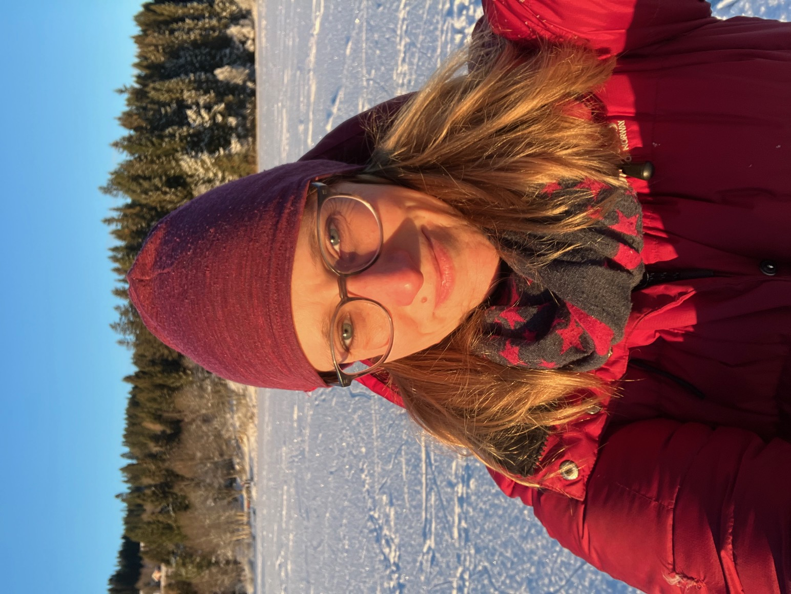
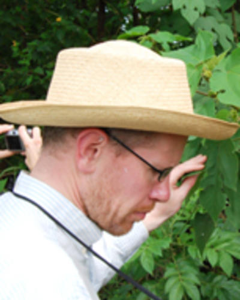
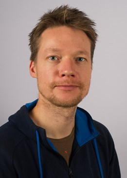
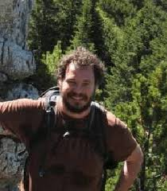
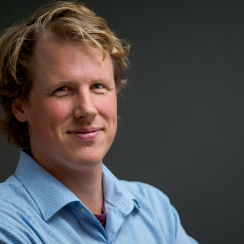

We are a group of ecologists, statisticians and everything in between, with interests in Open Science, reproducibility and transparency in Ecology.

```{=html}
<style>
.person {
  display: grid;
  grid-template-columns: 11rem minmax(0, 1fr);
  gap: 0.4rem 1.4rem;
  align-items: start;
  margin: 0 0 2.4rem;
}
.person-photo img {
  width: 100%;
  height: auto;
  border-radius: 10px;
  display: block;
}
.person-bio h4 {
  margin: 0 0 0.45rem;
}
.person-bio p:last-child {
  margin-bottom: 0;
}
@media (max-width: 640px) {
  .person {
    grid-template-columns: 1fr;
    gap: 0.7rem;
  }
  .person-photo img {
    width: 8.5rem;
  }
}
</style>
```

::::: person
::: person-photo

:::

::: person-bio
#### Aud H. Halbritter

I am a researcher in plant ecology at the University of Bergen (Norway) interested in global change impacts on alpine biodiversity and ecosystem functions. I have co-developed bioST\@TS, an online teaching and learning platform on data processing and reproducible workflows. I also develope tools for reproducible workflows and quantitative analysis, and have initiated and lead this early career course on Open Science.
:::
:::::

::::: person
::: person-photo

:::

::: person-bio
#### Matt Grainger

I am a researcher at NINA (Norwegian Institute for Nature Research) interested in evidence-based conservation and in metascience ("the science of science"). I am a part of the Living Norway Ecological Data Network and within that project focus on developing tools (e.g. R packages, Shiny Apps, etc.) and workflows to help researchers share their data openly and to make use of open data in their research. I am a member of the ESHackathon, an interdisciplinary community of practice making evidence-based decisions easier to achieve through opensource software, and SORTEE (Society for Open, Repeatable and Transparent Ecology and Evolution).
:::
:::::

::::: person
::: person-photo

:::

::: person-bio
#### Dag Endresen

I am the node manager for [GBIF Norway](https://www.gbif.no/), the Norwegian participant node of the [Global Biodiversity Information Facility](https://www.gbif.org/), based at the Natural History Museum, University of Oslo. I work on biodiversity informatics, including data standards and open publication of biodiversity data, and I teach people how to publish and use those data. Before joining the museum I worked at the GBIF secretariat and at the Nordic Genetic Resources Center.
:::
:::::

::::: person
::: person-photo

:::

::: person-bio
#### Michal Torma

I am a head engineer at the Natural History Museum, University of Oslo, and a data steward at [GBIF Norway](https://www.gbif.no/). I publish biodiversity data, teach people how to work with it, and help digitise metadata from the museum collections. My background is in environmental science and programming.
:::
:::::

::::: person
::: person-photo

:::

::: person-bio
#### Stefanie Muff

I am an Associate Professor in Statistics at the Norwegian University of Science and Technology (NTNU) in Trondheim, Norway. I am collaborating with biologists and ecologists on a regular basis and is therefore having an intrinsic interest in open and reproducible science.
:::
:::::

::::: person
::: person-photo

:::

::: person-bio
#### Richard J. Telford

I am a palaeoecologist at the University of Bergen (UiB), Norway. I am interested in quantitative palaeoecology, keen to make research in ecology and palaeoecology more reproducible and the organiser of R-klubben, a drop-in peer-to-peer R help session at the Department of Bioscience at UiB.
:::
:::::

::::: person
::: person-photo

:::

::: person-bio
#### Erlend B. Nilsen

I am a professor at Nord University. I am an applied quantitative ecologist, working mainly with bird and mammal populations and with how climate, harvest and land use affect them. I initiated the [Living Norway Ecological Data Network](https://livingnorway.no/), which works to make ecological data open and reusable, and I am interested in how we look after ecological data so that other researchers and society can use it.
:::
:::::

::::: person
::: person-photo

:::

::: person-bio
#### Joe Chipperfield

I am a researcher at NINA. I work on statistical ecology, including species distribution models and ways to estimate wildlife abundance from spatial capture-recapture data. I also develop tools for open biodiversity data, including the [LivingNorway R package](https://livingnorway.github.io/LivingNorwayR/), which helps researchers publish ecological datasets in the Darwin Core standard.
:::
:::::

::::: person
::: person-photo

:::

::: person-bio
#### Sam Perrin

I am a biodiversity researcher at NTNU's Department of Natural History. I work with open biodiversity data and species distribution models, and I build automated pipelines that turn those data into maps of where conservation should be prioritised. Before that I did a PhD on climate change and invasive species in freshwater ecosystems, and I founded [Ecology for the Masses](https://www.ecologyforthemasses.com/).
:::
:::::