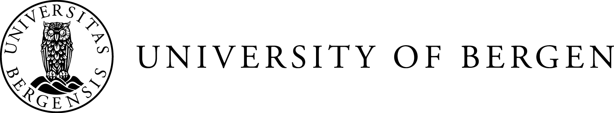
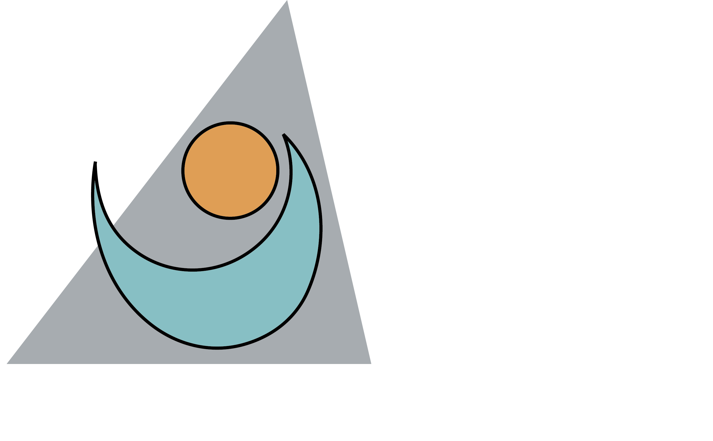
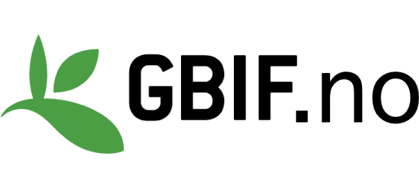
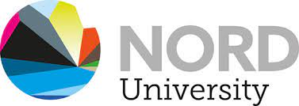
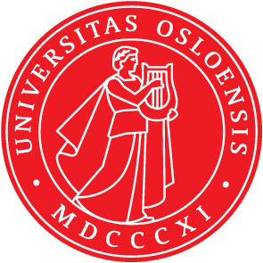

## The aim

[We](about_us.qmd) are a group of ecologists and statisticians in Norway that want to increase the awareness of these principles in our community and provide education and teaching material on on open and reproducible science in ecology.

## What we do

We organize [courses and workshops](courses) on Open Science for ecologists.

We provide the [teaching material](course_content) for the Open Science course openly available.

We develop [tools](course_content) to facilitate Open Science practices in our community.

## Acknowledgements

Open Science Training is part of the [Living Norway Ecological Data Network](https://livingnorway.no/) and a collaboration with the University of Bergen, Nord University, GBIF Norway, Norwegian University of Science and Technology, University of Oslo and Norwegian Institute for Nature Research.

```{=html}
<style>
.partners {
  display: flex;
  flex-wrap: wrap;
  justify-content: center;
  align-items: center;
  gap: 1.35rem 1.8rem;
  margin: 1.4rem 0 0.3rem;
}
.partners p,
.partners figure,
.partners .quarto-figure {
  margin: 0;
}
.partners img {
  display: block;
  height: 4.4rem;
  width: auto;
  max-width: 100%;
}
.partners img.logo-wide {
  height: 3.15rem;
}
.partners img.logo-tall {
  height: 5.4rem;
}
</style>
```

::: partners
{.logo-wide fig-alt="Living Norway Ecological Data Network"}

{.logo-wide fig-alt="University of Bergen"}

{fig-alt="Norwegian Institute for Nature Research"}

{fig-alt="GBIF Norway"}

{.logo-wide fig-alt="Nord University"}

{.logo-tall fig-alt="NTNU"}

{.logo-tall fig-alt="University of Oslo"}
:::

## License

The material on this webpage is licensed under a Creative Commons Attribution-BY 4.0 International. For more information see [here](https://creativecommons.org/licenses/by/4.0/).